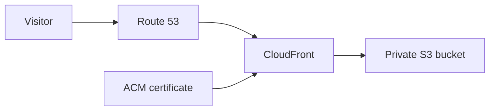
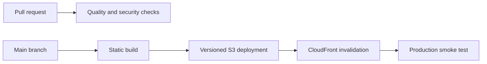

# AWS deployment architecture

## Decision

Deploy the portfolio as static files in a private Amazon S3 bucket and serve them through Amazon
CloudFront.

The application has no server-side routes, API endpoints, database, or runtime computation. Running
it continuously on ECS or EKS would add cost and operational work without adding user value.

## Request flow

The domain can remain registered with Porkbun while its authoritative DNS is hosted in Route 53.
CloudFront uses an ACM certificate issued in `us-east-1`, which is an AWS requirement for CloudFront
certificates.

## Deployment flow

GitHub Actions authenticates to AWS with OpenID Connect. It receives short-lived credentials by
assuming a narrowly scoped IAM role, so no permanent AWS access keys are stored in GitHub.

## Planned controls

- S3 Block Public Access enabled.
- CloudFront Origin Access Control as the only path to the S3 objects.
- TLS enforced at CloudFront.
- Security response headers applied at the edge.
- S3 versioning for recoverable deployments.
- CloudFront access logs stored in a separate log bucket.
- CloudWatch alarms and an availability check.
- Terraform state stored remotely with locking and encryption.
- GitHub environments used to protect production deployment.

## Why the container is not deployed

The Docker image proves that the build is reproducible and that the exported site can run in a
minimal, non-root environment. The same static files are deployed directly to S3 in production.
Removing the container runtime also removes patching, task health, load balancer, and scaling concerns
from the production system.

## Tools intentionally excluded

- EKS and Helm are excluded because there is no Kubernetes workload.
- ECS is excluded because the application needs no runtime compute.
- Prometheus is excluded because the static site exposes no application metrics endpoint.
- Grafana is deferred until there are enough metrics or multiple systems to justify operating a
  separate visualization layer.

CloudWatch, CloudFront logs, and synthetic availability monitoring cover the signals this workload
actually produces.
